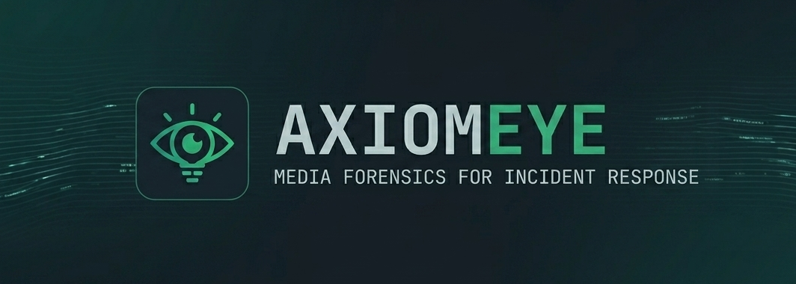

<p align="center">
  
</p>
# AxiomEye: Media Forensics for Incident Response

AxiomEye is an advanced, domain-specific media forensics and digital verification platform engineered to detect digital image manipulation, compression anomalies, and generative adversarial network (GAN) deepfakes. Designed specifically for investigative journalists, security analysts, and incident response teams, the platform leverages a hybrid pipeline combining decentralized computer vision execution with centralized linguistic orchestration.

---

## System Architecture & Core Mechanics

AxiomEye does not rely on generic, high-level semantic vision models to determine file integrity. Instead, it executes an objective, two-tier physical file analysis:

1. **Error Level Analysis (ELA):** Performs pixel-level matrix manipulation to recalculate structural quantization tables, isolating areas of non-uniform compression anomalies.
2. **Convolutional Neural Network (CNN):** A local binary classifier trained on the **FaceForensics++** dataset to detect microscopic pixel checkerboard frequencies and GAN-generated structural artifacts.
3. **Orchestration Layer:** Utilizes the hosted `trae-reasoning-v1` language engine as a synthesis layer to translate raw mathematical matrices and CNN confidence scores into comprehensive, natural language forensic intelligence briefings.

---

## Deployment & Hosting Notice

> [!IMPORTANT]
> **Hosting Configuration Statement:**
> AxiomEye is designed as a locally containerized or air-gapped workbench application. **It is not hosted on the public internet, and there is no active remote web deployment.** All core image manipulation, file parsing, and neural network inference execute locally within your isolated runtime environment to ensure maximum data privacy, chain-of-custody preservation, and source protection.

---

## Installation & Local Setup

Prerequisites: Ensure you have **Python 3.10+**, **Node.js 18+**, and **Git** installed on your host machine.

### 1. Clone the Repository
```bash
git clone [https://github.com/awdtyo/AxiomEye.git](https://github.com/awdtyo/AxiomEye.git)
cd AxiomEye
```
### 2. Backend Environment Configuration
```bash
cd backend
python -m venv venv
source venv/bin/activate
pip install -r requirements.txt
```
### 3. Environment Variables
```bash
TRAE_API_KEY=your_secure_trae_api_key_here
PORT=8000
```
### 4. Initialize the Local Servers
```bash
# Ensure your venv is active
uvicorn main:app --reload --port 8000
```
### 5. Start the frontend
```bash
cd frontend
npm install
npm run dev
```
The unified interface will compile locally and settle at http://localhost:5173 (or your configured Vite/React local port), communicating directly with the backend service running at http://127.0.0.1:8000
